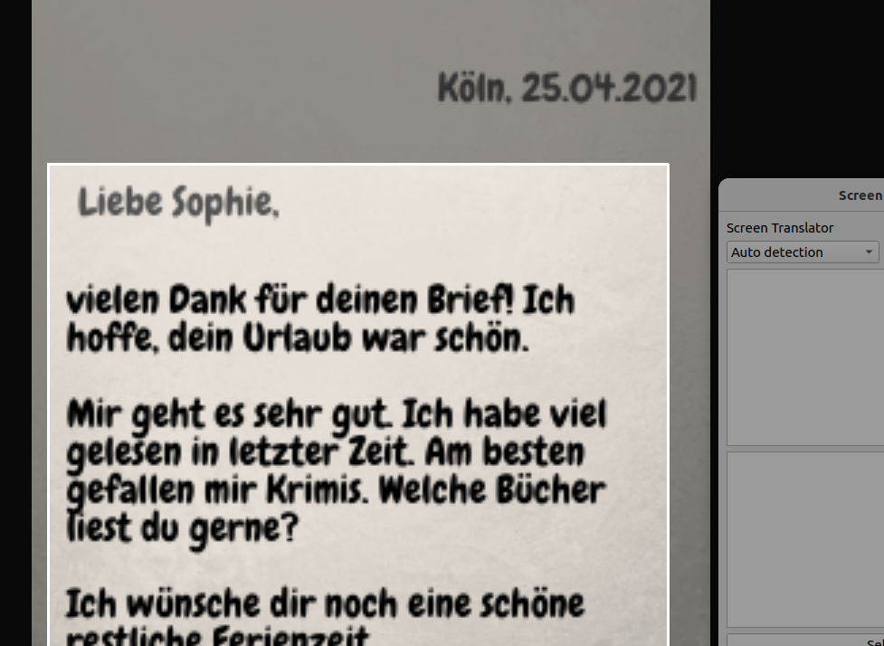
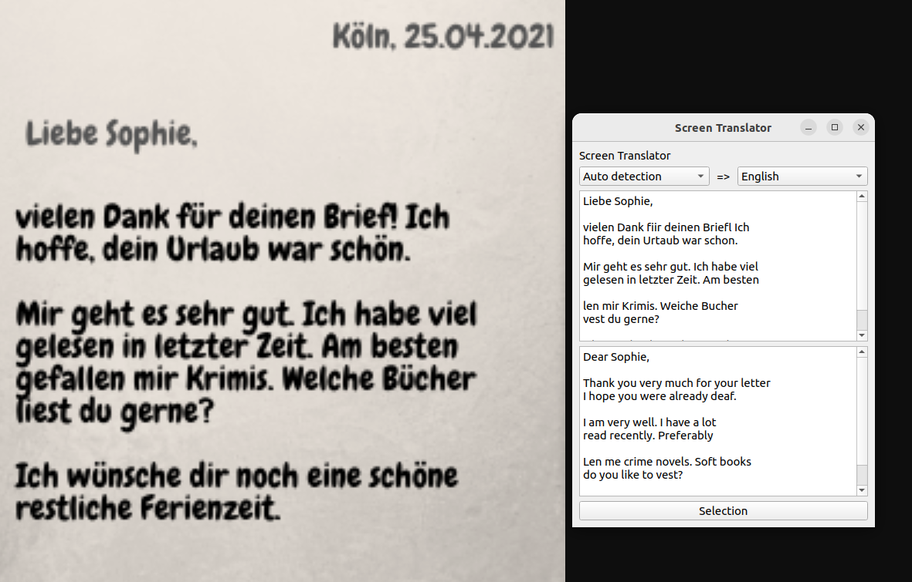
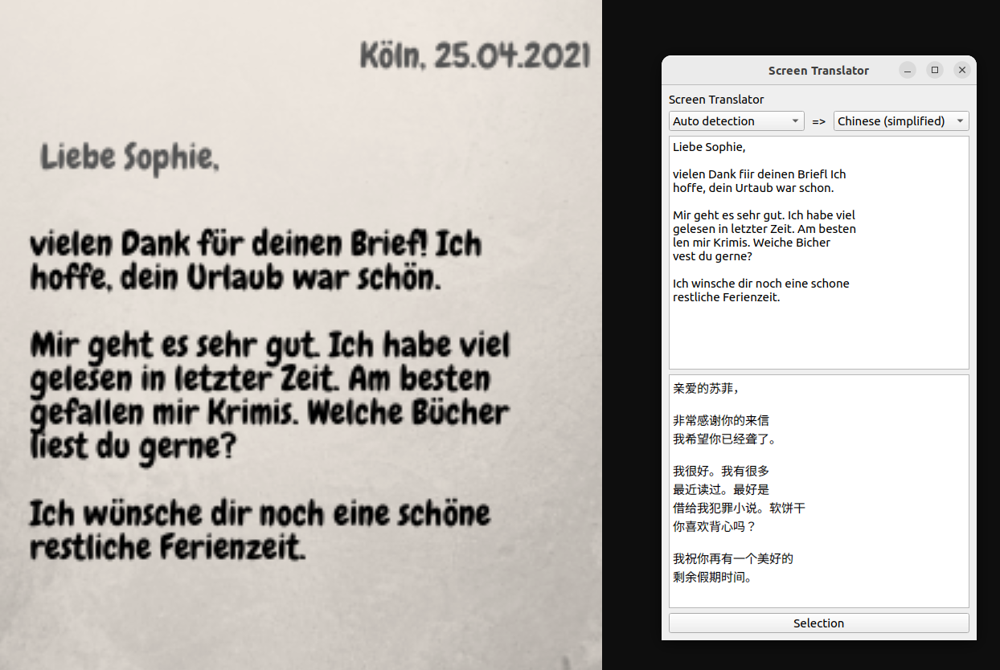

# ocrtran --  a tool to OCR Screen and translate text into any languages 

This application captures text from the screen using Optical Character Recognition (OCR) and translates it into any language using the Google Translate API.

## How to Run

### Dependencies
- Python 3
- Required Python packages listed in `requirements.txt`

Install the dependencies using the following command:
```sh
pip install -r requirements.txt
```

### Run
Execute the following command to run the application:
```sh
python ocrtran.py
```
## Screenshots
<br>
<br>
<br>


Upon running the application, a graphical user interface will appear. You can capture text from the screen and translate it into your desired language.


